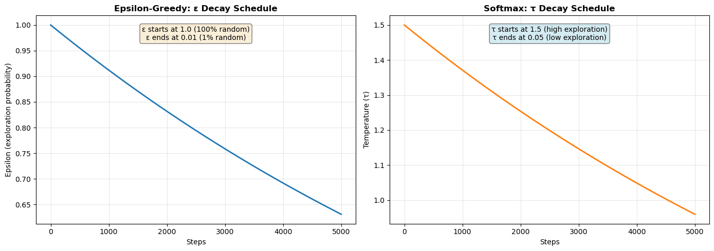
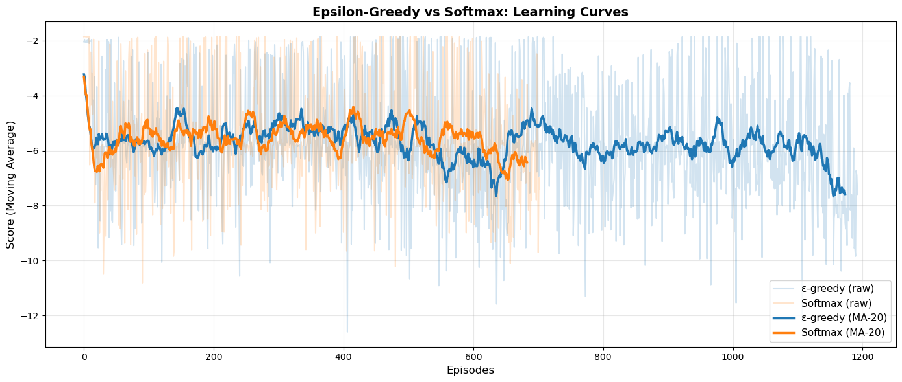

# Tetris Reinforcement Learning Agent (DQN)

This repository contains a Deep Q-Network (DQN) project for Atari Tetris, implemented in Python with Gymnasium and PyTorch.  
The project compares two exploration strategies under the same training setup:
- Epsilon-greedy exploration
- Softmax (Boltzmann) exploration

## Problem Description and Environment

The task is to train an agent to play Atari Tetris (`ALE/Tetris-v5`) by maximizing long-term return through line clearing and survival.

Environment characteristics:
- Source: Gymnasium + ALE (Arcade Learning Environment)
- Observation type: visual (image frames)
- Action space: discrete Atari action set from the environment
- Stochasticity: environment transitions and exploration policy introduce variability

Key assumptions and constraints:
- Pixel observations are preprocessed before reaching the policy network.
- Reward shaping is used to reduce sparse-reward learning issues.
- Results are from a single-seed experiment and should be interpreted as exploratory, not definitive.

## Reinforcement Learning Formulation

### State Representation
The state is a stack of 4 preprocessed grayscale frames (shape derived from wrappers), designed to provide short-term temporal context.

Preprocessing pipeline:
1. `AtariPreprocessing` with explicit settings (`frame_skip=1`, `screen_size=128`, grayscale, scaled obs)
2. Spatial crop to retain playfield-relevant area (`CropObservation`, width reduced to focus on board)
3. Normalization to `[0,1]`
4. 4-frame stacking (`FrameStackObservation`)

### Action Space
The action space is the discrete set provided by `ALE/Tetris-v5` (`env.action_space.n`).

### Reward Function
A shaped reward wrapper (`LinesReward`) is used:
- Line clears receive scaled bonuses
- Terminal failure applies a penalty
- Small per-step penalty discourages ineffective play

Line-clear shaping used in code:
- 0 lines: `0.0`
- 1 line: `line_bonus`
- 2 lines: `2.5 * line_bonus`
- 3 lines: `4.0 * line_bonus`
- 4 lines: `7.0 * line_bonus`

Rationale:
- Tetris rewards are sparse/delayed; shaping increases feedback density.
- Faster credit assignment helps stabilize early learning.

## Algorithmic Approach

The project uses a value-based RL approach: Deep Q-Network (DQN) with:
- Online Q-network and target Q-network
- Experience replay
- Huber loss (`smooth_l1_loss`)
- Gradient clipping
- Periodic target synchronization

Exploration policies compared:
- Epsilon-greedy with decay from `1.0` to `0.01`
- Softmax exploration with temperature decay from `1.5` to `0.05`

Why DQN is appropriate:
- Discrete action space
- High-dimensional visual input handled by convolutional encoders
- Off-policy replay improves sample reuse and stability

Main hyperparameters (from notebook):
- `max_episodes = 2500`
- `batch_size = 128`
- `gamma = 0.95`
- `learning_rate = 1e-3`
- `target_update_steps = 500`
- Replay buffer size: `30000`
- Early stopping patience: `700`

## Implementation Details

Software stack:
- Python
- Gymnasium + ALE (`ale_py`)
- PyTorch
- NumPy
- Matplotlib
- ImageIO
- Jupyter Notebook

Repository structure:
- `Tetris.ipynb`: full training and evaluation pipeline
- `dqn_epsilon.pt`: trained checkpoint (epsilon-greedy run)
- `dqn_softmax.pt`: trained checkpoint (softmax run)
- `best_game_epsilon.gif`: rollout visualization (epsilon-greedy)
- `best_game_softmax.gif`: rollout visualization (softmax)

Training flow summary:
1. Build wrapped environment
2. Initialize Q-networks, optimizer, replay buffer
3. Interact with environment and store transitions
4. Optimize online network from replay samples
5. Periodically update target network
6. Evaluate policy over episodes
7. Save best model and GIF rollouts

## Experimental Setup and Evaluation

Evaluation protocol:
- Periodic policy evaluation using mean score over 5 episodes
- Two separate experiments with matched core settings
- Aligned metric comparison over common episode window

Metrics used:
- Mean score
- Max score
- Min score
- Standard deviation (stability)
- Cumulative score trend
- Episodes until stop/convergence behavior

### Quantitative Results (from notebook outputs)

| Metric | Epsilon-Greedy | Softmax |
|---|---:|---:|
| Mean Score (aligned comparison) | -5.54 | -5.50 |
| Final Avg ± Std | -5.68 ± 2.09 | -5.50 ± 1.93 |
| Max Score | -1.84 | -1.84 |
| Episodes Observed | 1193 | 703 |
| Winner (mean/stability in this run) | - | Softmax |

Sample rollout scores used when exporting GIFs:
- Epsilon rollout: `-11.4`
- Softmax rollout: `-5.9`

## Results and Discussion

Observed behavior in this run:
- Softmax achieved slightly better average return.
- Softmax showed lower variance, indicating smoother learning.
- Peak score was similar across both strategies.
- Softmax converged in fewer episodes under this stopping criterion.

Interpretation:
- The gain is mostly in consistency/stability, not peak performance.
- Softmax likely helped by preserving probabilistic preference among high-value actions during exploration.

Limitations:
- Single-seed result; no confidence intervals across multiple seeds.
- Reward shaping may bias behavior toward short-term proxy signals.
- Hyperparameter sensitivity not fully explored.

## Visual Results (GIFs)

### Epsilon-Greedy Policy


### Softmax Policy


## Graphs and Data Snapshots

The following static graphs are extracted directly from notebook outputs, so they match the exact visual results produced during the experiment.


### Plot A: Learning Curves (Raw + Moving Average)


### Plot B: Detailed Metric Comparison (4-panel analysis)


Plot generation utility script:
- `extract_notebook_plots.py`

## How to Run the Code

### 1. Environment setup
```bash
python -m venv .venv
source .venv/bin/activate
pip install --upgrade pip
pip install numpy torch matplotlib imageio ipython gymnasium ale-py "gymnasium[atari,accept-rom-license]"
```

If ROM setup is required by your local ALE installation:
```bash
AutoROM --accept-license
```

### 2. Launch notebook
```bash
jupyter notebook Tetris.ipynb
```

### 3. Train and evaluate
Run notebook cells in order:
1. Imports and environment creation
2. Model/replay setup
3. Softmax and epsilon training blocks
4. Plot/analysis cells
5. GIF export cell

### 4. Use pretrained models
The repository already includes:
- `dqn_epsilon.pt`
- `dqn_softmax.pt`

Load the corresponding checkpoint in the notebook and run the policy visualization / GIF export cells.

## References

- Gymnasium Documentation: https://gymnasium.farama.org/
- ALE / Atari environments: https://ale.farama.org/
- PyTorch Documentation: https://pytorch.org/docs/stable/index.html


## Academic Use and Attribution

This repository is intended for educational and academic use. The code and documentation are coursework artifacts. When reusing or extending this material, follow the repository license and properly acknowledge original authors.

## Disclaimer

This implementation prioritizes clarity, reproducibility, and learning value. It is not guaranteed to be production-ready or optimized for industrial deployment.
